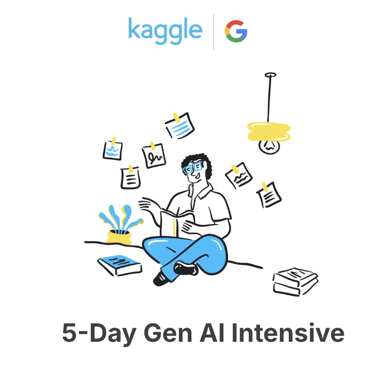

  

# PaintPilot – AI-Powered Paint Estimator

This project is part of the Kaggle GenAI Capstone 2025Q1. It explores how to combine computer vision and large language models (LLMs) to help homeowners or professionals estimate paint requirements from room photos.

## Features

- Upload a photo of an interior wall
- Use LLM to describe the scene and ask guiding questions
- Estimate area, paint volume and tools based on assumptions or user inputs
- Generate a natural-language summary and shopping list
- Evaluates its ouputs

## Technologies

- Gemini 2.0 (Vision & text)
- Python + Pillow + matplotlib
- Kaggle Notebook
- LangGraph, LangChain, Agent Flows

## Dataset

Images curated from Unsplash/Pexels  
See: [interior-wall-samples on Kaggle](https://www.kaggle.com/datasets/YOUR_DATASET_URL)

## Blogpost

[GitHub Pages Link](https://federco23.github.io/Kaggle_GenAI-paintpilot/)

## Video

[Youtube Link](https://youtu.be/nTRpVflG9_U)

## Team

This project was developed as part of the Kaggle GenAI Intensive Course Capstone (2025Q1).

## Contributors
- [Ben Kern](https://www.linkedin.com/in/benkernconsulting/) 
- [Federico Bessi](https://www.linkedin.com/in/federicobessi/)

Special thanks to the Kaggle and Google GenAI team for the course and inspiration!🚀.

## Citation

@misc{gen-ai-intensive-course-capstone-2025q1,
  author       = {Addison Howard and Brenda Flynn and Myles O'Neill and Nate and Polong Lin},
  title        = {Gen AI Intensive Course Capstone 2025Q1},
  year         = {2025},
  howpublished = {\url{[https://kaggle.com/competitions/gen-ai-intensive-course-capstone-2025q1](https://kaggle.com/competitions/gen-ai-intensive-course-capstone-2025q1)}},
  note         = {Kaggle}
}

---

Contributions welcome • Licensed under MIT / CC0
